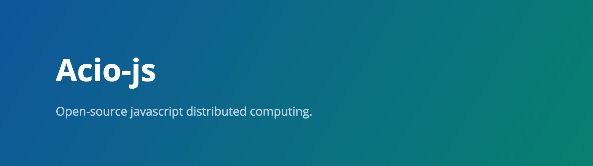

# 

Acio-JS allows to split JS computing jobs across multiple browsers via it's embeddable library.

The library uses web sockets to deliver jobs and collect results, web workers for client-side secure code execution and indexedDB for storage.

Visit [Acio-js website](https://joseconstela.github.io/acio-js/) for more information.

Remember to visit Acio-js repository: [joseconstela/acio-js](https://github.com/joseconstela/acio-js)

## Installation
Install MeteorJS.

For __OSX or Linux__ install the latest official Meteor release from your terminal:

    curl https://install.meteor.com/ | sh

For __Windows__ simply download and run the official Meteor installer:

&nbsp;&nbsp;&nbsp;&nbsp;[https://install.meteor.com/windows](https://install.meteor.com/windows)

If nececsary, specify your environment variables, as they have default values:

    export PORT=3000
    export MONGO_URL=mongodb://localhost:27017/database

## Usage
To launch the application, simple execute:

    meteor
